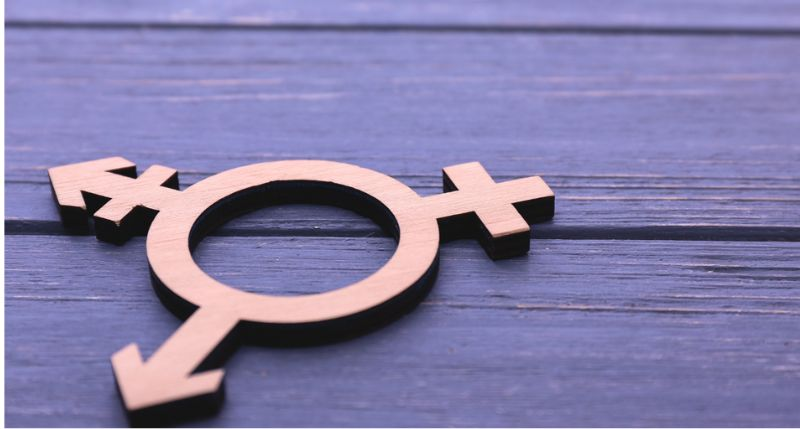

# 🚀 Automated Gender Classification Using CNN 👩👨  
 *<!-- Replace with your actual header image -->*

This project implements a **Convolutional Neural Network (CNN)** to classify images based on gender. The model predicts between two classes:  
🔴 **Female (👩)** | 🟢 **Male (👨)**  

The entire pipeline includes:
- **Data preprocessing** (resizing, normalization)
- **Image augmentation** (for training & testing)
- **CNN model training**
- **Deployment as an interactive web app using Streamlit**

---

## 📊 Data Processing Pipeline  
### **1️⃣ Data Collection**  
- Dataset consists of **labeled images** of male and female faces.

### **2️⃣ Data Exploration**  
- **Visualizing sample images** for both classes.
- **Checking class balance** to avoid bias in the model.

### **3️⃣ Data Preprocessing**  
- **Resizing**: Standardizing images to `64x64` pixels.
- **Color Normalization**: Scaling pixel values from **0-255** to **0-1**.
- **Format Conversion**: Converting images into NumPy arrays.

### **4️⃣ Image Augmentation**  
**To improve model generalization, the following transformations are applied:**

#### 🔹 **For Training Data**  
✅ **Random Rotation**  
✅ **Horizontal Flip**  
✅ **Brightness Adjustment**  
✅ **Zoom & Shear Transformation**  

#### 🔹 **For Testing Data**  
🔸 **Only Normalization (`/255.0`)** (no random transformations).  

---

## 🧠 CNN Model Architecture  
```mermaid
graph TD
    A[Input 64x64x3] --> B[Conv2D 32@3x3]
    B --> C[ReLU]
    C --> D[MaxPooling 2x2]
    D --> E[Conv2D 64@3x3]
    E --> F[ReLU]
    F --> G[MaxPooling 2x2]
    G --> H[Flatten]
    H --> I[Dense 128]
    I --> J[ReLU]
    J --> K[Dense 2]
    K --> L[sigmoid]
